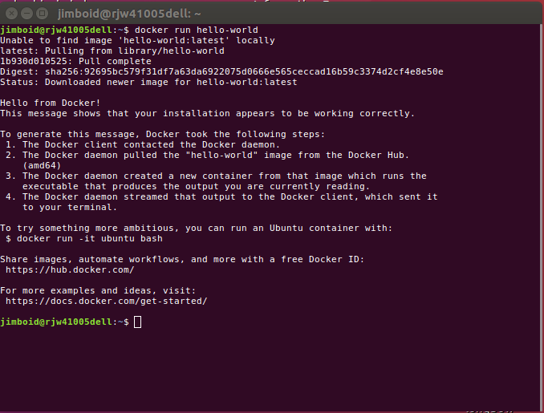
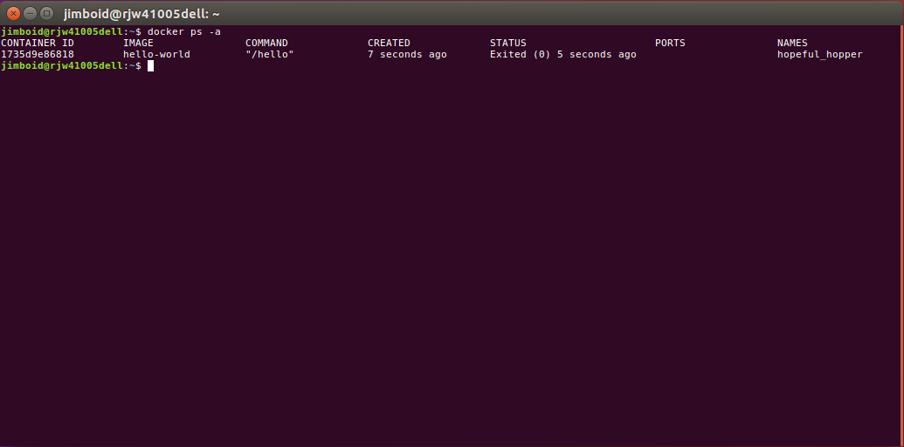

==================================
Get going with Docker from Scratch
==================================

We will start out this class by installing Docker if you haven't already.

For ubuntu users this is now as simple as::

% sudo apt install docker.io

and so we don't have to sudo to use docker::

% sudo usermod -aG docker $USER

For folks not wanting to use ubuntu then you will need to head over to the docker website and look how to install for your platform here_.

.. _here: https://docs.docker.com/install/

Running your first container
============================

We will first start out running the "Hello World" container. To run this container do::

% docker run hello-world

You should see the following output in your terminal

You should be able to see that Docker could not find the container on your local machine and thus decided to pull it from Docker Hub. 

The hello-world container simply displays a message that tells us that everything is working OK with your Docker installation, it spells out the steps it took to run it and a suggestion for further steps. But that is it, you have run your first docker container!

More Container Commands
=======================

Now you have run your first container, it would be useful if you could interrogate what containers you have installed on your system.

To list our containers we run the following::

% docker ps -a

and you should see something like this

The information here is quite detailed. You can see the **container id** unique to each instance, the **image** tells you which container images it is deployed from. The **status** column give the container run status, in this case it will print the hello message and exit, but other services and servers may run without exiting. **ports** will tell you which physical ports on your machines you have mapped to a container port. **NAMES** gives you the friendly name generated for your container instance, either set explicitly by you or if not, randomly generated.

What happens if we run the same container again?

.. code-block:: bash

    % docker run hello-world

What does **docker ps -a** show now?

.. code-block:: bash

    % docker ps -a

It should look something like this:

.. image:: /images/docker3.png

We now have two separate instances of the hello-world container each with different container id and different names. Docker has not reused the first container to generate the second, but it did reuse the same hello-world images to generate a new instance of the hello-world container. If we wanted to reuse a container, then we use a different command.

To reuse a container we would use the following::

% docker start --attach <container name>

You should replace **<container name>** with the name listed in the names column for one of the containers from the list when listing your containers "docker ps -a". The "--attach" flag simply tells docker to connect to the containers output so we can see the results in our terminal.

You should have seen with the Docker start command that output was the same as before, this is because you have re-executed one of the hello-world containers already deployed on your system. If you run *docker ps -a* again you'll notice that you still only have the same 2 containers deployed.

